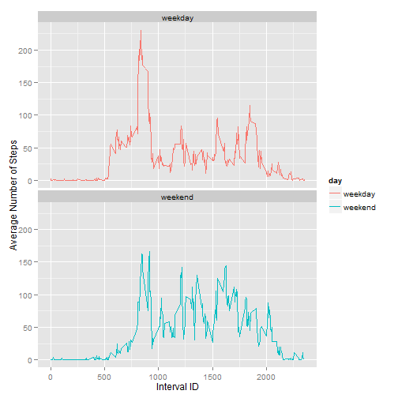

## Loading and preprocessing the data
Assumption: The data is found in a zipped file named *activity.zip*, as is originally from Roger Peng's GitHub repository.
The code below unzips the file, and reads in the CSV file into a dataframe for processing:

```r
df <- read.csv(unzip("activity.zip"))
```

## What is the mean total number of steps taken per day?
Shown below is a histogram of the total number of steps taken each day.

```r
df_agg_date <- aggregate(steps ~ date, data = df, FUN = sum)
hist(df_agg_date$steps, xlab = "Total Number of Steps Taken Each Day", main = "Histogram of Total Number of Steps Taken Each Day")
```

 

The *mean* total number of steps taken per day is given by:

```r
mean(df_agg_date$steps)
```

```
## [1] 10766
```

The *median* total number of steps taken per day is given by:

```r
median(df_agg_date$steps)
```

```
## [1] 10765
```


## What is the average daily activity pattern?
The below time series plot gives an idea of the average daily activity pattern of this person.

```r
# Get the average steps per interval ID. Missing values (NA) are ignored, ie: the observation with the missing value is omitted entirely.
df_agg_interval <- aggregate(steps ~ interval, data = df, FUN = mean, na.action = na.omit) 

plot(df_agg_interval$steps ~ df_agg_interval$interval , type = "l", xlab = "Interval ID", ylab = "Average Number of Steps")
```

 

#### The 5-minute interval containing the maximum number of steps
On average across all the days in the dataset, the 5-minute interval which contains the maximum number of steps, has the Interval ID: **835**


## Imputing missing values
The total number of rows which have at least 1 NA (ie: missing value) is given by the below code:

```r
sum(!complete.cases(df))
```

```
## [1] 2304
```

My strategy for filling in all the missing values in the dataset, is to replace the NA value of each row, with the *average of all non-NA observations for that 5-minute interval*.

This is achieved by the code below:

```r
# Combine the 2 dataframes using the "interval" field, keeping all rows from the original data frame.
df_merge <- merge(x = df, y = df_agg_interval, by = "interval", all.x = TRUE)
# Merging messes up the column names; this restores them.
names(df_merge) <- c("interval", "steps", "date", "mean")
# For rows with NA in the "steps" field, replace it with the value in the "mean" field.
df_merge$steps[is.na(df_merge$steps)] <- df_merge$mean[is.na(df_merge$steps)]
# Gets rid of the unnecessary column.
df_merge$mean <- NULL

df_merge_agg_date <- aggregate(steps ~ date, data = df_merge, FUN = sum)
```

A histogram based on the completed data set, is as follows:

```r
hist(df_merge_agg_date$steps, xlab = "Total Number of Steps Taken Each Day", main = "Histogram of Total Number of Steps Taken Each Day (No NAs)")
```

 

The *recalculated mean* total number of steps taken per day is given by:

```r
mean(df_merge_agg_date$steps)
```

```
## [1] 10766
```

The *recalculated median* total number of steps taken per day is given by:

```r
median(df_merge_agg_date$steps)
```

```
## [1] 10766
```

#### Observations
The values of the mean and median calculated from the 2nd dataset (no NAs) are generally the same as those calculated from the 1st dataset (with missing values).  

The impact of imputing the missing data on the estimates of the total daily number of steps, is that this total figure went up. This makes sense, because as more observations went from NA to some value, the total number of steps should logically go up.  
This shows up most obviously in the center bar of the histogram, where the frequency goes up visibly.  


## Are there differences in activity patterns between weekdays and weekends?

```r
# "day" is the new column, which will eventually contain either "weekday" or "weekend".
df_merge$day <- weekdays(as.Date((df_merge[,"date"])))
df_merge$day[grep("Monday|Tuesday|Wednesday|Thursday|Friday", df_merge$day)] <- "weekday"
df_merge$day[grep("Saturday|Sunday", df_merge$day)] <- "weekend"
df_merge$day <- factor(df_merge$day)

# Get the average steps per interval ID, separated by weekday/weekend.
df_agg_interval_day <- aggregate(steps ~ interval + day, data = df_merge, FUN = mean) 

library(ggplot2)
qplot(x = interval, y = steps, data = df_agg_interval_day, geom = "line", color = day, xlab = "Interval ID", ylab = "Average Number of Steps") + facet_wrap( ~ day, nrow = 2)
```

 

Based on the above charts, there are some visible differences in activity patterns between weekdays and weekends. Specifically, on weekdays, there's more activity earlier, probably because the person has to go to work. Subsequently, the activity generally subsides, as the person probably has a deskbound job and is mainly sitting down. 
On weekends, the person most likely sleeps until later, but spends more time throughout the rest of the day doing activities, as can be seen by the generally higher average number of steps.
